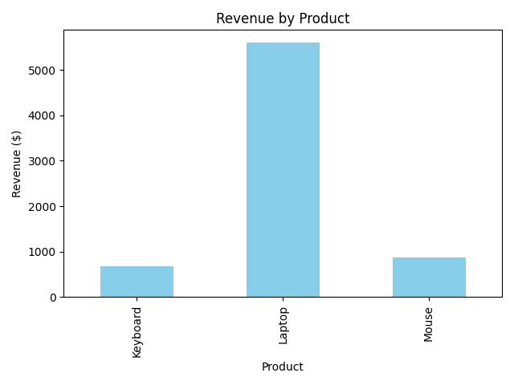

# 🧾 Task 7: Sales Summary using SQLite and Python

This project is a simple Python script that demonstrates how to:
- Create a small SQLite database
- Insert sales records into a table
- Run SQL queries to summarize total quantity sold and revenue per product
- Display the results using `print()` and a basic `matplotlib` bar chart

---

## 📂 Files Included

| File | Description |
|------|-------------|
| `task7_sales_summary.py` | Main Python script that runs the entire process |
| `sales_chart.png` | Bar chart showing revenue by product |
| `.gitignore` | Excludes unnecessary files from the repo |
| `README.md` | This file |

---

## 🛠️ Tools Used

- Python 3
- `sqlite3` (built-in)
- `pandas`
- `matplotlib`

---

## 📈 Output

After running the script, you will see:
1. A printed table showing:
   - Product name
   - Total quantity sold
   - Total revenue generated
2. A bar chart saved as `sales_chart.png`

**Example output:**

```bash
📦 Basic Sales Summary:
product total_qty revenue
0 Keyboard 15 675.0
1 Laptop 7 5600.0
2 Mouse 35 875.0
```



---

## 🚀 How to Run

1. Clone the repository:
```bash
   git clone https://github.com/yourusername/task7-sales-summary-sqlite-python.git
   cd task7-sales-summary-sqlite-python
```
2. Create and activate a virtual environment (optional but recommended):
```bash
python3 -m venv venv
source venv/bin/activate  # or .\venv\Scripts\activate on Windows
```
3. Install required packages:
```bash
pip install pandas matplotlib
```
4. Run the script:
```bash
python3 task7_sales_summary.py
```
## 📌 Notes

- The database (`sales_data.db`) is **auto-created and pre-populated** by the script.
- **No external dataset is required** — all data is generated within the script.

---

## 🎯 Learning Outcomes

By completing this task, you’ll learn how to:

- ✅ Write basic **SQL queries** inside Python
- ✅ Use **SQLite** for simple data storage
- ✅ Import SQL data into **pandas**
- ✅ Visualize data using **matplotlib**
